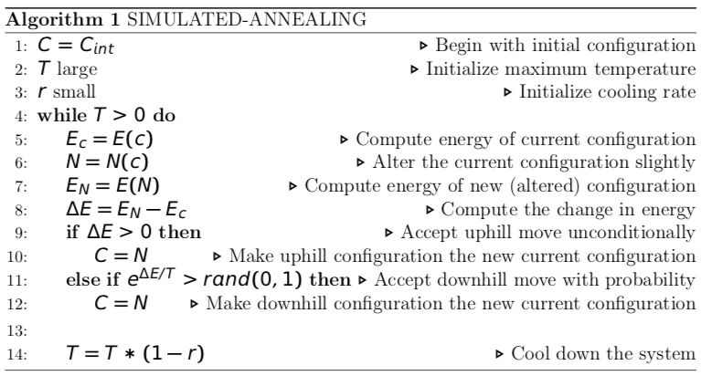
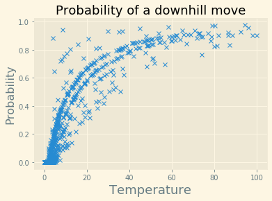

# Futoshiki Simulated Annealing #

The following program solved the Japanese puzzle game Futoshiki using the metaheuristic algorithm, simulated annealing. Simulated annealing is a higher-level metaheuristic procedure which combines the stochastic process of a random walk with hill climbing. The folder already contains two executables, futoshiki and futoshiki2. The former executable solves the 'easy' difficulty futoshiki puzzle, which can viewed in the easy.png file, whilst the later executable solves the 'extreme' difficulty futoshiki puzzle. The executables are written such that they can be run multiple times with different outcomes. 

A hill-climbing algorithm that never makes “downhill” moves toward states with lower value (or higher cost) is guaranteed to be incomplete, because it can get stuck on a local maximum. In contrast, a purely random walk—that is, moving to a successor chosen uniformly at random from the set of successors—is complete but extremely inefficient. Therefore, it seems reasonable to try to combine hill climbing with a random walk in some way that yields both efficiency and quasi-completeness. Simulated annealing is such an algorithm.
Imagine the task of getting a ping-pong ball into the deepest crevice in a bumpy surface. If we just let the ball roll, it will come to rest at a local minimum. If we shake the surface, we can bounce the ball out of the local minimum. The trick is to shake just hard enough to bounce the ball out of local min-ima but not hard enough to dislodge it from the global minimum. The simulated-annealing solution is to start by shaking hard (i.e., at a high temperature) and then gradually reduce the intensity of the shaking (i.e., lower the temperature).

This notion of slow cooling implemented in the Simulated annealing algorithm is interpreted as a slow decrease in the probability of accepting worse solutions as the solution space is explored. Accepting worse solutions is a fundamental property of metaheuristics because it allows for a more extensive search for the global optimal solution. The following is a graphicalrepresentation of the probability that the simulated annealing algorithm accepts a downhill movement, as the temperature decreases (look at this graph from right to left).

APPLICATION

The simulated annealing process is traditionally used in optimization problems, however, the metaheuristics of the process may be applied to constraint satisfaction problems, such as in puzzle games, where constraints are initially specified. In the case of Futoshiki, there seems to be an infinite number of possible configurations where a human, or a computer, can get stuck in a local maxima; for example, when inequality constraints are completely satisfied but the row and column constraints are not, or vice versa. This is when it becomes abundantly necessary to accept downhill movements; to abandon inequality constraint satisfaction, and thus move out of a local maxima, in the hope that a worse configuration will later lead to a better configuration, wherein inequality constraints are satisfied but so too are the row and column constraints.  

IMPLEMENTATION

The pseudocode for the Simulated Annealing algorithm, as implemented inside the program, is as follows: 

The algorithm begins with an initial configuration, C = Cint, that is initialized inside the initial_configuration() function. This function initializes the current configuration of the board. Any values that are initially specified at the beginning of the game are initialized here, whereas all other values are initialized to the value one. Two important variables in the simulated annealing process are then initialized, the temperature of the system T and its cooling rate r. We begin with an initial high temperature, T = 100, because we intend to slowly cool the system using the cooling rate variable r= 0.000002.
The algorithm then computes the energy of the current configuration, E = E(c), using the compute_energy() function. This  function is the key to the simulated annealing process. The simulated annealing process will only alter the current configuration if the new configuration is better than the old one, or else, it will accept the bad configuration with some probability. Thus, reward increments are used to represent the energy of the system, and furthermore, reveal how close to the solution (the global maximum energy) the current configuration is.  
After computing the energy of the current configuration, it then slightly alters the current configuration of the system, N=next(c), using the alter_configuration() function.  The alter_configuration() function uses the std::shuffle function from the main to generate two random integers, i and j, in the range [0,4] and uses them as indexers on each iteration to alter one of the elements on the Futoshiki board: data[i][j] = some new random value in the range [1,5], and thus generate a new configuration of the board. 
The algorithm then computes, E = EN -EC, the change in energy of the new configuration compared to the current one. This is equivalent to asking, “is the newly generated configuration closer to the solution?” If the change in energy is positive, i.eE > 0, then the change in energy is a good one, and the algorithm accepts the new configuration unconditionally (since it is ‘closer’ to a solution). The algorithm then makes the new configuration, N, the current configuration, C, C = N. In other words, the algorithm accepts ‘uphill’ moves unconditionally. 
However, unlike a hill-climbing algorithm, the Simulated Annealing algorithm also accepts downhill movements with a certain probability. If the probability parameter, eE/T, is greater than some random number between 0 and 1, i.e eE/T> rand(0,1), then we accept the downhill movement. Due to the nature of this probability parameter, eE/T, the algorithm accepts a number of downhill movements when the temperature T is large, and as temperature Tcools (decreases), the algorithm begins to accept only uphill movements.

